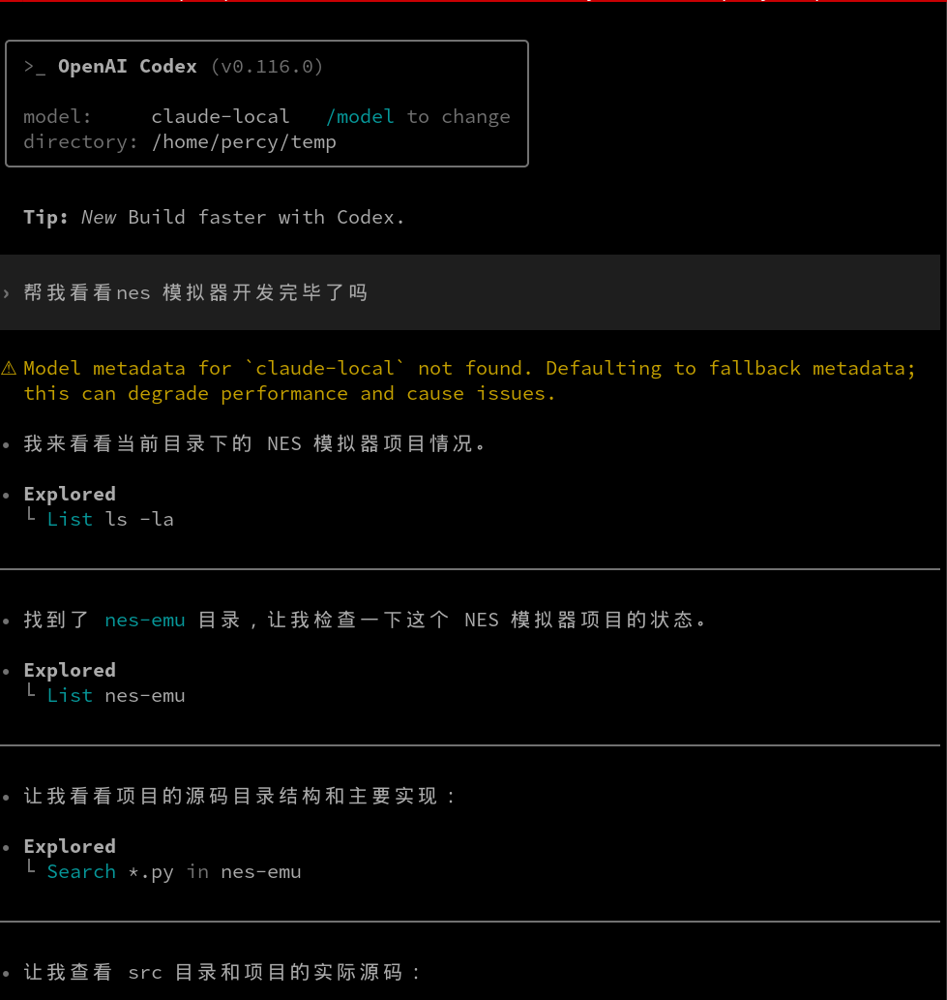

# LLM Universal Proxy

[中文文档](./README_CN.md)

A single-binary HTTP proxy that provides a unified interface for Large Language Model APIs. It accepts requests in multiple LLM API formats, routes models to named upstreams, and automatically handles format conversion when needed.

**Use GLM, Kimi, MiniMax, and other non-native models in Codex CLI, Claude Code, and Gemini CLI through one stable proxy layer.**

This proxy is especially useful when your client only supports one protocol, but the real model you want to use lives behind another one. For example, newer Codex CLI versions only speak the OpenAI Responses API, but `llm-universal-proxy` can still let Codex use Anthropic-compatible or OpenAI-Completions-compatible coding models such as GLM, Kimi, or MiniMax.


The dashboard gives you a direct view into routing, streaming, cancellation, upstream traffic, and hook state while the proxy is running.



This is a real Codex CLI session using a local alias routed to `GLM-5-Turbo` through the proxy.

## Features

- **Multi-Format Support**: Accepts requests in 4 different LLM API formats:
  - Google Gemini
  - Anthropic Claude
  - OpenAI Chat Completions
  - OpenAI Responses API
- **Auto-Discovery**: Automatically detects which formats the upstream service supports
- **Smart Routing**: Passes through requests when client format matches upstream capabilities (no translation overhead)
- **Format Translation**: Seamlessly converts between formats when needed
- **Streaming Support**: Handles both streaming and non-streaming responses
- **Concurrent Requests**: Asynchronous handling for high performance
- **Named Upstreams**: Route requests to multiple upstream providers from one proxy instance
- **Local Model Aliases**: Expose one unique local model name for any upstream model
- **Audit Hooks**: Optional async `exchange` / `usage` HTTP hooks for request-response capture and metering
- **Local Debug Trace**: Optional JSONL trace for per-turn debugging without shipping traffic to external hooks
- **Credential Policy**: Supports fallback credentials, direct configured credentials, and force-server auth
- **Codex CLI Friendly**: Works as a Responses-compatible endpoint in front of Anthropic-compatible upstreams
- **Model Unification Layer**: Map models from different providers to one stable local naming scheme, such as `opus`, `sonnet`, `haiku`, or team-specific coding aliases

## Why It Is Useful

- **One stable model namespace across providers**: You can map models from different vendors into one local naming layer. For example, different upstream models can be exposed as stable names such as `opus`, `sonnet`, `haiku`, or any team-specific alias. That makes tools that assume fixed model names easier to operate.
- **Useful for Claude Code style workflows**: If you want Claude-style routing semantics but your real upstreams come from different vendors, the proxy can present a consistent set of local model names while routing to whichever provider you choose underneath.
- **Useful for modern Codex CLI**: Newer Codex CLI versions only speak the OpenAI Responses API. This proxy lets Codex use upstreams that speak Anthropic Messages, OpenAI Chat Completions, or other non-Responses-compatible APIs. That is especially useful when you want to use coding-capable providers such as GLM, MiniMax, or Kimi behind a Responses-only client.
- **Cross-provider protocol bridge**: You can place Anthropic-compatible, OpenAI-compatible, and Gemini-style upstreams behind one consistent interface instead of teaching each client multiple protocols.
- **Built-in observability for analysis**: `usage` hooks export metering data; `exchange` hooks export full client-facing query/response pairs. That makes it practical to persist production traffic for auditing, analytics, evaluation, or later model-training pipelines.

## Client Namespace Map

Use the namespace that matches the client protocol instead of the upstream vendor:

| Client | Namespace | Typical Use |
|------|------|------|
| Codex CLI | `/openai/v1` | Responses client in front of Anthropic or OpenAI-compatible coding models |
| Claude Code | `/anthropic/v1` | Anthropic Messages client in front of Anthropic-compatible upstreams |
| Gemini CLI | `/google/v1beta` | Gemini-native client in front of Google-style or translated upstreams |

## Codex With GLM-5-Turbo

When Codex uses a custom local model alias through the proxy, Codex may fall back to built-in default metadata for unknown model names. That fallback assumes a `272000` token window and does not set an automatic compaction threshold, which can make auto-compact happen too late or not at all.

For `GLM-5-Turbo`, set both values explicitly at launch time:

```bash
HOME="/tmp/tmp-codex" GLM_APIKEY='...' codex resume --yolo \
  -C /path/to/worktree \
  -c 'model="claude-local"' \
  -c 'model_provider="glm-proxy"' \
  -c 'model_providers.glm-proxy.name="GLM Proxy"' \
  -c 'model_providers.glm-proxy.base_url="http://127.0.0.1:18149/openai/v1"' \
  -c 'model_providers.glm-proxy.env_key="GLM_APIKEY"' \
  -c 'model_providers.glm-proxy.wire_api="responses"' \
  -c 'model_context_window=200000' \
  -c 'model_auto_compact_token_limit=176000'
```

Recommended thresholds for `GLM-5-Turbo`:
- Default: `176000` (`88%` of 200k)
- More conservative: `170000`
- More aggressive: `184000`

Set `model_context_window` to the real upstream limit and tune only `model_auto_compact_token_limit` if you want compaction earlier or later.

### How Codex Compact Actually Works With A Proxy

When Codex talks to a custom proxy-backed provider, compaction does not behave exactly like official OpenAI-hosted Codex.

- Codex has two compaction paths:
  - official OpenAI provider: remote `/responses/compact`
  - custom providers: local inline compaction using the current model
- The remote compact path is only used when Codex recognizes the provider as built-in OpenAI. A custom provider such as `glm-proxy` does not qualify, even if it serves a Responses-compatible API.
- That means proxy-backed Codex sessions use model-generated summarization, not the official OpenAI compact service.

Practical consequences:

- Compact quality depends on the routed upstream model, because that model is the one producing the summary.
- Compact timing depends on token accounting coming back through the proxy. If usage mapping is wrong, Codex may compact too late or not at all.
- Compact replacement history is still reconstructed by Codex locally, so protocol normalization after compaction matters. If translated history contains roles or message layouts that the upstream rejects, the next turn after compaction can fail even though compaction itself succeeded.

Important boundary:

- The proxy does not persist or grow system prompts on its own.
- Codex may inject new compacted thread summaries into later requests.
- The proxy only normalizes those messages so they remain valid for the upstream protocol.

Best practice for proxy-backed Codex sessions:

- Set both `model_context_window` and `model_auto_compact_token_limit`.
- Prefer shorter threads and start a new thread after multiple compactions.
- Treat proxy-backed compact as "local summary compaction" rather than "official OpenAI remote compaction".

## Installation

### Download Binary

Download the latest release from the [Releases](https://github.com/lzjever/llm-universal-proxy/releases) page.

### Build from Source

```bash
# Clone the repository
git clone https://github.com/lzjever/llm-universal-proxy.git
cd llm-universal-proxy

# Build release binary
cargo build --release

# The binary will be at ./target/release/llm-universal-proxy
```

### Using Make

```bash
make build        # Build release binary
make test         # Run all tests
make run-release  # Build and run in release mode
```

## Configuration

The proxy is configured with a YAML file passed via `--config`:

```yaml
listen: 0.0.0.0:8080
upstream_timeout_secs: 120

upstreams:
  GLM-OFFICIAL:
    api_root: https://open.bigmodel.cn/api/anthropic/v1
    format: anthropic
    credential_env: GLM_APIKEY
    auth_policy: client_or_fallback

  OPENAI:
    api_root: https://api.openai.com/v1
    format: openai-responses
    credential_env: OPENAI_API_KEY
    auth_policy: force_server

model_aliases:
  GLM-5: GLM-OFFICIAL:GLM-5
  gpt-4o: OPENAI:gpt-4o

hooks:
  max_pending_bytes: 104857600
  timeout_secs: 30
  failure_threshold: 3
  cooldown_secs: 300
  usage:
    url: https://example.com/hooks/usage
  exchange:
    url: https://example.com/hooks/exchange

debug_trace:
  path: /tmp/llm-proxy-debug.jsonl
  max_text_chars: 16384
```

Notes:
- `api_root` should be the official upstream API root and must include the version segment, for example `https://api.openai.com/v1`, `https://api.anthropic.com/v1`, or `https://generativelanguage.googleapis.com/v1beta`.
- The proxy's public API is namespaced by protocol. Use `/openai/v1/...`, `/anthropic/v1/...`, and `/google/v1beta/...`. The older mixed `/v1/...` routes are intentionally not provided.
- Anthropic-compatible upstreams usually require `x-api-key` and `anthropic-version`. The proxy forwards client auth headers when present, can fall back to the upstream's configured `credential_env`, and injects a default `anthropic-version: 2023-06-01` header for Anthropic upstreams.
- Provider-specific headers belong inside each upstream entry's `headers` object.
- `credential_env` is the environment variable name holding that upstream's fallback credential. The secret stays out of the YAML file.
- `credential_actual` can be used instead of `credential_env` when you want to place a fallback credential directly in YAML. `credential_env` and `credential_actual` are mutually exclusive.
- `auth_policy` supports `client_or_fallback` and `force_server`.
- Hooks are best-effort and asynchronous. `usage` is usually enough; `exchange` captures the full client-facing request/response pair after the request completes.
- `debug_trace` writes a local JSONL file for debugging protocol issues. It is designed for interactive troubleshooting, not long-term traffic archival.
- `debug_trace` records only the tail "new input" portion of each client request rather than rewriting the full accumulated conversation each turn.
- For streaming responses, `debug_trace` records the processed client-visible result: aggregated text, reasoning text, tool-call deltas, terminal event, finish reason, and any normalized error. It does not dump raw SSE JSON lines.

### Full YAML Reference

```yaml
listen: 0.0.0.0:8080
upstream_timeout_secs: 120

upstreams:
  UPSTREAM_NAME:
    api_root: https://example.com/v1
    format: anthropic
    credential_env: EXAMPLE_API_KEY
    # credential_actual: sk-xxx
    auth_policy: client_or_fallback
    headers:
      x-example-header: example-value

model_aliases:
  local-model-name: UPSTREAM_NAME:real-upstream-model

hooks:
  max_pending_bytes: 104857600
  timeout_secs: 30
  failure_threshold: 3
  cooldown_secs: 300
  usage:
    url: https://example.com/hooks/usage
    authorization: Bearer usage-hook-token
  exchange:
    url: https://example.com/hooks/exchange
    authorization: Bearer exchange-hook-token

debug_trace:
  path: /tmp/llm-proxy-debug.jsonl
  max_text_chars: 16384
```

### Top-Level Fields

| Field | Type | Required | Default | Description |
|------|------|----------|---------|-------------|
| `listen` | string | No | `0.0.0.0:8080` | Proxy listen address in `host:port` form |
| `upstream_timeout_secs` | integer | No | `120` | Timeout for upstream HTTP requests |
| `upstreams` | map | Yes | none | Named upstream definitions |
| `model_aliases` | map | No | empty | Maps local model names to `upstream:model` |
| `hooks` | object | No | disabled | Optional async audit and usage export hooks |
| `debug_trace` | object | No | disabled | Optional local JSONL debug trace for per-turn request/response summaries |

### `debug_trace`

Use `debug_trace` when you need to troubleshoot client or proxy behavior locally and want something lighter than full exchange capture.

```yaml
debug_trace:
  path: /tmp/llm-proxy-debug.jsonl
  max_text_chars: 16384
```

Design notes:
- The request entry records only the new tail input for the current turn, not the full accumulated transcript.
- The response entry records a normalized summary.
  - Non-streaming: summarized final body.
  - Streaming: aggregated text, aggregated reasoning text, tool-call deltas, terminal event such as `response.completed` or `response.failed`, and normalized error details when present.
- This format is meant to answer "what did the client add this turn?" and "what did the model actually send back?" without forcing you to reconstruct long raw SSE logs.

### `upstreams`

`upstreams` is a YAML object keyed by upstream name:

```yaml
upstreams:
  GLM-OFFICIAL:
    api_root: https://open.bigmodel.cn/api/anthropic/v1
    format: anthropic
    credential_env: GLM_APIKEY
```

Each upstream supports these fields:

| Field | Type | Required | Default | Description |
|------|------|----------|---------|-------------|
| `api_root` | string | Yes | none | Official upstream API root including version |
| `format` | enum | No | auto-discover | Fixed upstream protocol format |
| `credential_env` | string | No | none | Environment variable name containing the fallback credential |
| `credential_actual` | string | No | none | Fallback credential written directly in YAML |
| `auth_policy` | enum | No | `client_or_fallback` | Controls whether client auth is honored |
| `headers` | map<string,string> | No | empty | Static headers injected into every upstream request |

Rules:
- `credential_env` and `credential_actual` are mutually exclusive.
- If `auth_policy: force_server` is used, the upstream must define either `credential_env` or `credential_actual`.
- `headers` are per-upstream, not global.

#### `format` enum

Allowed values:

| Value | Meaning |
|------|---------|
| `openai-completion` | OpenAI Chat Completions style upstream |
| `openai-responses` | OpenAI Responses style upstream |
| `anthropic` | Anthropic Messages style upstream |
| `google` | Google Gemini GenerateContent / streamGenerateContent style upstream |
| `responses` | Alias of `openai-responses` |

If omitted, the proxy probes the upstream to determine supported formats.

#### `auth_policy` enum

| Value | Meaning |
|------|---------|
| `client_or_fallback` | Use client-provided auth if present; otherwise use the upstream fallback credential |
| `force_server` | Ignore client-provided auth and always use the upstream fallback credential |

### `model_aliases`

`model_aliases` maps one stable local model name to one concrete upstream model:

```yaml
model_aliases:
  sonnet: ANTHROPIC:claude-sonnet-4
  coder-fast: GLM-OFFICIAL:GLM-4.5-Air
```

Rules:
- Key: local model name exposed to clients
- Value: `UPSTREAM_NAME:REAL_MODEL_NAME`
- Local model names should be unique
- If multiple upstreams are configured and a request uses an unmapped bare model name, the proxy returns `400`

### `hooks`

`hooks` configures optional async HTTP exports for audit and metering.

| Field | Type | Required | Default | Description |
|------|------|----------|---------|-------------|
| `max_pending_bytes` | integer | No | `104857600` | Max combined in-memory bytes pending for hook delivery |
| `timeout_secs` | integer | No | `30` | Per-hook HTTP timeout |
| `failure_threshold` | integer | No | `3` | Consecutive failures before a hook enters cooldown |
| `cooldown_secs` | integer | No | `300` | Cooldown period before retrying a failed hook |
| `usage` | object | No | disabled | Usage export hook |
| `exchange` | object | No | disabled | Full request/response export hook |

Hook behavior:
- Hooks are asynchronous and best-effort.
- `usage` is usually enough for billing or observability.
- `exchange` captures the full client-facing request/response pair after completion, including completed streaming responses.
- When pending hook payloads exceed `max_pending_bytes`, new hook payloads are dropped until pressure falls.
- Each hook type has its own circuit breaker. After `failure_threshold` consecutive failures, that hook pauses for `cooldown_secs`.

#### `hooks.usage` and `hooks.exchange`

Each endpoint supports:

| Field | Type | Required | Default | Description |
|------|------|----------|---------|-------------|
| `url` | string | Yes | none | HTTP or HTTPS endpoint to receive hook payloads |
| `authorization` | string | No | none | Optional `Authorization` header value for the hook request |

## Usage

### Multi-Upstream Example

```bash
cat > proxy.yaml <<'YAML'
listen: 0.0.0.0:8080
upstream_timeout_secs: 120

upstreams:
  GLM-OFFICIAL:
    api_root: https://open.bigmodel.cn/api/anthropic/v1
    format: anthropic
    credential_env: GLM_APIKEY
    auth_policy: client_or_fallback

  OPENAI:
    api_root: https://api.openai.com/v1
    format: openai-responses
    credential_env: OPENAI_API_KEY
    auth_policy: force_server

model_aliases:
  GLM-5: GLM-OFFICIAL:GLM-5
  gpt-4o: OPENAI:gpt-4o
YAML

export GLM_APIKEY="your-glm-key"
export OPENAI_API_KEY="your-openai-key"

./llm-universal-proxy --config proxy.yaml
```

Clients can then select a model in either of these ways:
- Explicit upstream selector: `GLM-OFFICIAL:GLM-5`
- Local alias: `GLM-5`

If more than one upstream is configured and a model is not an explicit `upstream:model` reference or a configured alias, the proxy returns `400`.

### Stable Local Model Names

One practical pattern is to expose a provider-neutral local naming layer and hide vendor-specific model IDs behind it:

```yaml
model_aliases:
  opus: ANTHROPIC:claude-opus-4-1
  sonnet: ANTHROPIC:claude-sonnet-4
  haiku: ANTHROPIC:claude-haiku-4
  coder-fast: GLM-OFFICIAL:GLM-4.5-Air
  coder-strong: KIMI:kimi-k2
```

Clients can then request `opus`, `sonnet`, `haiku`, `coder-fast`, or `coder-strong` without caring which upstream vendor actually serves the request.

### Codex CLI to an Anthropic-Compatible Upstream

This is the practical setup for tools such as Codex CLI when the real upstream speaks the Anthropic Messages API but the client expects the OpenAI Responses API.

1. Start the proxy against the Anthropic-compatible upstream:

```bash
cat > codex-proxy.yaml <<'YAML'
listen: 127.0.0.1:8099

upstreams:
  GLM-OFFICIAL:
    api_root: https://open.bigmodel.cn/api/anthropic/v1
    format: anthropic
    credential_env: GLM_APIKEY

model_aliases:
  GLM-5: GLM-OFFICIAL:GLM-5
YAML

./target/release/llm-universal-proxy --config codex-proxy.yaml
```

2. Point Codex CLI at the local proxy with an isolated config:

```bash
HOME="$(mktemp -d)" GLM_APIKEY="your-real-key" codex exec --ephemeral \
  -c 'model="GLM-5"' \
  -c 'model_provider="glm-proxy"' \
  -c 'model_providers.glm-proxy.name="GLM Proxy"' \
  -c 'model_providers.glm-proxy.base_url="http://127.0.0.1:8099/openai/v1"' \
  -c 'model_providers.glm-proxy.env_key="GLM_APIKEY"' \
  -c 'model_providers.glm-proxy.wire_api="responses"' \
  'Reply with exactly: codex-ok'
```

Notes:
- This does not modify your global Codex CLI configuration because it uses a temporary `HOME` and `--ephemeral`.
- The client talks OpenAI Responses to the proxy at `/openai/v1/responses`; the proxy resolves local model `GLM-5` to `GLM-OFFICIAL:GLM-5`, then translates upstream to Anthropic Messages.
- For providers that need extra static headers beyond the Anthropic default, set the upstream's `headers` field in the matching upstream entry.

#### Custom Text-Only Models For Codex

If your local Codex model alias is not present in Codex's built-in model catalog, Codex falls back to generic metadata. That fallback assumes the model supports both text and image input. For proxy-backed custom models, that is often wrong: many upstreams are text-only, and some setups also want the built-in web search tool disabled.

To avoid that mismatch, provide Codex with a custom `model_catalog_json` entry for your local alias. This lets you:

- mark the model as text-only with `input_modalities: ["text"]`
- disable built-in web search with `supports_search_tool: false` and `web_search="disabled"`
- set the real context window and compaction threshold for the upstream model

Example `catalog.json` for a proxy-backed `GLM-5-TURBO` alias:

```json
{
  "models": [
    {
      "slug": "codex-anthropic",
      "display_name": "codex-anthropic",
      "description": "Custom proxy-backed Codex model with text-only input.",
      "default_reasoning_level": "medium",
      "supported_reasoning_levels": [
        { "effort": "low", "description": "Fast responses with lighter reasoning" },
        { "effort": "medium", "description": "Balances speed and reasoning depth for everyday tasks" },
        { "effort": "high", "description": "Greater reasoning depth for complex problems" },
        { "effort": "xhigh", "description": "Extra high reasoning depth for complex problems" }
      ],
      "shell_type": "shell_command",
      "visibility": "list",
      "supported_in_api": true,
      "priority": 0,
      "availability_nux": null,
      "upgrade": null,
      "base_instructions": "You are Codex, a coding agent based on GPT-5. You and the user share the same workspace and collaborate to achieve the user's goals.",
      "model_messages": null,
      "supports_reasoning_summaries": false,
      "default_reasoning_summary": "auto",
      "support_verbosity": false,
      "default_verbosity": null,
      "apply_patch_tool_type": "freeform",
      "web_search_tool_type": "text",
      "truncation_policy": { "mode": "bytes", "limit": 10000 },
      "supports_parallel_tool_calls": false,
      "supports_image_detail_original": false,
      "context_window": 200000,
      "auto_compact_token_limit": 176000,
      "effective_context_window_percent": 95,
      "experimental_supported_tools": [],
      "input_modalities": ["text"],
      "supports_search_tool": false
    }
  ]
}
```

Start Codex with that custom catalog:

```bash
HOME="$(mktemp -d)" GLM_APIKEY="your-real-key" codex \
  -C /path/to/worktree \
  -m codex-anthropic \
  -c 'model_provider="glm-proxy"' \
  -c 'model_providers.glm-proxy.name="GLM Proxy"' \
  -c 'model_providers.glm-proxy.base_url="http://127.0.0.1:18149/openai/v1"' \
  -c 'model_providers.glm-proxy.env_key="GLM_APIKEY"' \
  -c 'model_providers.glm-proxy.wire_api="responses"' \
  -c 'model_catalog_json="/path/to/catalog.json"' \
  -c 'web_search="disabled"' \
  -s danger-full-access \
  -a never
```

Notes:
- `model_catalog_json` is applied on startup only. Update the file first, then start a new Codex session.
- `input_modalities: ["text"]` prevents Codex from treating the model as image-capable.
- `supports_search_tool: false` removes the built-in search tool from the model metadata, and `web_search="disabled"` ensures the runtime search mode stays off.
- `context_window` and `auto_compact_token_limit` should match the real upstream model, not Codex's generic fallback values.

### Isolated CLI Smoke Tests

The following patterns let you verify real CLI clients against the proxy without touching user-level configuration. Every example uses a temporary `HOME` and placeholder credentials.

Start the proxy first:

```yaml
listen: 127.0.0.1:18129
upstream_timeout_secs: 120

upstreams:
  GLM-ANTHROPIC:
    api_root: https://open.bigmodel.cn/api/anthropic/v1
    format: anthropic
    credential_env: GLM_APIKEY
    auth_policy: force_server

  GLM-OPENAI:
    api_root: https://open.bigmodel.cn/api/coding/paas/v4
    format: openai-completion
    credential_env: GLM_APIKEY
    auth_policy: force_server

model_aliases:
  claude-local: GLM-ANTHROPIC:GLM-5
  codex-local: GLM-OPENAI:glm-4.7
  gemini-local: GLM-OPENAI:glm-4.7
```

Run it with:

```bash
GLM_APIKEY="your-real-key" ./target/release/llm-universal-proxy --config proxec-test.yaml
```

Codex CLI via `/openai/v1`:

```bash
HOME="$(mktemp -d)" GLM_APIKEY=dummy codex exec --ephemeral \
  -C /path/to/llm-universal-proxy \
  -c 'model="codex-local"' \
  -c 'model_provider="proxec"' \
  -c 'model_providers.proxec.name="proxec"' \
  -c 'model_providers.proxec.base_url="http://127.0.0.1:18129/openai/v1"' \
  -c 'model_providers.proxec.env_key="GLM_APIKEY"' \
  -c 'model_providers.proxec.wire_api="responses"' \
  'Reply with exactly: codex-ok'
```

Claude Code via `/anthropic/v1`:

```bash
HOME="$(mktemp -d)" \
ANTHROPIC_API_KEY=dummy \
ANTHROPIC_BASE_URL='http://127.0.0.1:18129/anthropic' \
claude --print --output-format text --no-session-persistence \
  --model claude-local \
  'Reply with exactly: claude-ok'
```

Gemini CLI via `/google/v1beta`:

```bash
HOME="$(mktemp -d)" \
GEMINI_API_KEY=dummy \
GOOGLE_GEMINI_BASE_URL='http://127.0.0.1:18129/google' \
HTTP_PROXY= HTTPS_PROXY= http_proxy= https_proxy= \
NO_PROXY='127.0.0.1,localhost' no_proxy='127.0.0.1,localhost' \
gemini --prompt 'Reply with exactly: gemini-ok' \
  --model gemini-local \
  --sandbox=false \
  --output-format text
```

Notes:
- The proxy uses the configured upstream credential because `auth_policy: force_server` is set. The dummy client-side keys only satisfy CLI validation.
- Clearing proxy environment variables for Gemini CLI is recommended when the proxy is running on `127.0.0.1`, because some Node-based proxy stacks will otherwise try to send local traffic through the global HTTP proxy.
- Replace `/path/to/llm-universal-proxy` with your actual repository path or remove `-C` if you are already in the repository.

### Real Upstream Smoke Matrix

The repository includes a real smoke script that exercises Anthropic-compatible and OpenAI-compatible upstreams through the proxy:

```bash
GLM_APIKEY="your-real-key" python3 scripts/real_endpoint_matrix.py
```

It covers these client entrypoints:
- `/openai/v1/chat/completions`
- `/openai/v1/responses`
- `/anthropic/v1/messages`

And validates both non-streaming and streaming paths against:
- Anthropic-compatible upstreams
- OpenAI-compatible upstreams

### Docker

```bash
# Build the image
docker build -t llm-universal-proxy .

# Run the container
docker run -p 8080:8080 \
  -v "$PWD/proxy.yaml:/app/proxy.yaml:ro" \
  llm-universal-proxy \
  --config /app/proxy.yaml
```

### API Endpoints

| Endpoint | Description |
|----------|-------------|
| `POST /openai/v1/chat/completions` | OpenAI Chat Completions view |
| `POST /openai/v1/responses` | OpenAI Responses view |
| `GET /openai/v1/models` | OpenAI-compatible local model catalog |
| `GET /openai/v1/models/{id}` | OpenAI-compatible local model detail |
| `POST /anthropic/v1/messages` | Anthropic Messages view |
| `GET /anthropic/v1/models` | Anthropic-compatible local model catalog |
| `GET /anthropic/v1/models/{id}` | Anthropic-compatible local model detail |
| `GET /google/v1beta/models` | Gemini-compatible local model catalog |
| `GET /google/v1beta/models/{id}` | Gemini-compatible local model detail |
| `POST /google/v1beta/models/{model}:generateContent` | Gemini GenerateContent view |
| `POST /google/v1beta/models/{model}:streamGenerateContent` | Gemini streaming view |
| `GET /health` | Health check (returns `{"status":"ok"}`) |

### Example Requests

#### OpenAI Chat Completions Format

```bash
curl http://localhost:8080/openai/v1/chat/completions \
  -H "Content-Type: application/json" \
  -H "Authorization: Bearer YOUR_API_KEY" \
  -d '{
    "model": "gpt-4",
    "messages": [{"role": "user", "content": "Hello!"}],
    "stream": false
  }'
```

#### Anthropic Claude Format

```bash
curl http://localhost:8080/anthropic/v1/messages \
  -H "Content-Type: application/json" \
  -H "x-api-key: YOUR_API_KEY" \
  -H "anthropic-version: 2023-06-01" \
  -d '{
    "model": "claude-3-opus-20240229",
    "messages": [{"role": "user", "content": "Hello!"}],
    "max_tokens": 1024
  }'
```

#### Google Gemini Format

```bash
curl "http://localhost:8080/google/v1beta/models/gemini-local:generateContent" \
  -H "Content-Type: application/json" \
  -d '{
    "contents": [{"parts": [{"text": "Hello!"}]}]
  }'
```

## How It Works

1. **Format Detection**: Analyzes the request path and body to determine the client's API format
2. **Capability Discovery**: Probes the upstream service to determine supported formats
3. **Smart Routing**:
   - If client format matches upstream → **Passthrough** (zero overhead)
   - If formats differ → **Translation** using OpenAI Chat Completions as pivot format
4. **Streaming Support**: Handles SSE streams with chunk-by-chunk translation

## Architecture

```
                    ┌──────────────────────┐
                    │   LLM Universal      │
   Client Request   │       Proxy          │   Upstream Request
   (Any Format) ───▶│                      │──────────────────▶
                    │  ┌────────────────┐  │   (Converted if needed)
                    │  │   Detection    │  │
                    │  └───────┬────────┘  │
                    │          │           │
                    │  ┌───────▼────────┐  │
                    │  │   Translation  │  │
                    │  └───────┬────────┘  │
                    │          │           │
                    │  ┌───────▼────────┐  │
                    │  │   Upstream     │  │
                    │  │   Client       │──┼──────▶ OpenAI / Anthropic / Google
                    │  └────────────────┘  │
                    └──────────────────────┘
```

## Supported Format Conversions

| From → To | OpenAI | Anthropic | Gemini |
|-----------|--------|-----------|--------|
| OpenAI | ✅ Passthrough | ✅ Translate | ✅ Translate |
| Anthropic | ✅ Translate | ✅ Passthrough | ✅ Translate |
| Gemini | ✅ Translate | ✅ Translate | ✅ Passthrough |

## Development

```bash
# Run tests
cargo test

# Run with detailed test report
make test-report

# Check code
cargo clippy --all-targets --all-features -- -D warnings

# Format code
cargo fmt --all -- --check
```

## License

MIT License
