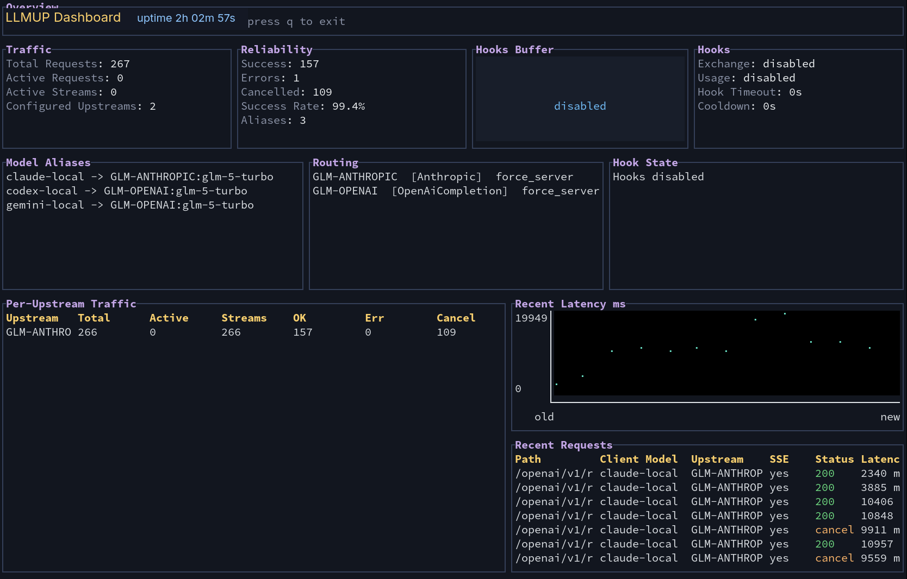

# LLM Universal Proxy

[English README](./README.md) · [文档索引](./docs/README.md)

`llmup` 是一个单二进制 LLM HTTP 代理。你可以把它放在客户端和真实模型服务之间，让不同协议的客户端都通过一个稳定入口访问上游模型；当客户端协议和上游协议不一致时，代理会自动完成必要的转换。

它最适合这些场景：

- 让 Codex CLI 使用非 OpenAI 原生的上游模型
- 让 Claude Code、Gemini CLI 通过一个本地代理接不同厂商
- 给客户端暴露稳定的本地 alias，而不是直接暴露厂商模型 ID

> [!IMPORTANT]
> `llmup` 适合连接 OpenAI / Anthropic / Gemini 风格 API，或兼容这些协议的服务。它不是把第三方工具接入厂商第一方 App 订阅权益的桥。



可选的本地 dashboard 可以帮助你查看路由、流式响应、取消、上游状态和 hook 工作情况。

## Quick Start

GA 用户入口采用 provider-neutral preset，并优先从 CLI wrapper 启动。推荐的配置源是 [examples/quickstart-provider-neutral.yaml](./examples/quickstart-provider-neutral.yaml)，它暴露两个稳定本地 alias：

- `preset-openai-compatible`：OpenAI-compatible lane
- `preset-anthropic-compatible`：Anthropic-compatible lane

MiniMax 只是一个可替换的 OpenAI-compatible 示例，不是 GA 必需 provider，也不是主线 preset 名称。如果你想看已经写死具体厂商的 OpenAI + MiniMax 样例，可以参考 [examples/quickstart-openai-minimax.yaml](./examples/quickstart-openai-minimax.yaml)。

provider-neutral 配置源如下：

```yaml
listen: 127.0.0.1:8080
upstream_timeout_secs: 120

upstreams:
  PRESET-ANTHROPIC-COMPATIBLE:
    api_root: PRESET_ANTHROPIC_ENDPOINT_BASE_URL
    format: anthropic
    credential_env: PRESET_ENDPOINT_API_KEY
    auth_policy: force_server
    limits:
      context_window: 200000
      max_output_tokens: 128000
    surface_defaults:
      modalities:
        input: ["text"]
        output: ["text"]
      tools:
        supports_search: false
        supports_view_image: false
        apply_patch_transport: freeform
        supports_parallel_calls: false

  PRESET-OPENAI-COMPATIBLE:
    api_root: PRESET_OPENAI_ENDPOINT_BASE_URL
    format: openai-completion
    credential_env: PRESET_ENDPOINT_API_KEY
    auth_policy: force_server
    limits:
      context_window: 200000
      max_output_tokens: 128000
    surface_defaults:
      modalities:
        input: ["text"]
        output: ["text"]
      tools:
        supports_search: false
        supports_view_image: false
        apply_patch_transport: freeform
        supports_parallel_calls: false

model_aliases:
  preset-anthropic-compatible: "PRESET-ANTHROPIC-COMPATIBLE:PRESET_ENDPOINT_MODEL"
  preset-openai-compatible: "PRESET-OPENAI-COMPATIBLE:PRESET_ENDPOINT_MODEL"
```

启动 wrapper-managed 会话前，先设置这些环境变量：

```bash
git clone https://github.com/lzjever/llm-universal-proxy.git
cd llm-universal-proxy
cargo build --locked --release

export PRESET_OPENAI_ENDPOINT_BASE_URL="https://openai-compatible.example/v1"
export PRESET_ANTHROPIC_ENDPOINT_BASE_URL="https://anthropic-compatible.example/v1"
export PRESET_ENDPOINT_MODEL="provider-model-id"
export PRESET_ENDPOINT_API_KEY="provider-api-key"
```

这些变量的含义：

| 变量 | 作用 |
| --- | --- |
| `PRESET_OPENAI_ENDPOINT_BASE_URL` | OpenAI-compatible 上游 API root，需要包含 `/v1` 这类版本段 |
| `PRESET_ANTHROPIC_ENDPOINT_BASE_URL` | Anthropic-compatible 上游 API root |
| `PRESET_ENDPOINT_MODEL` | wrapper 渲染到两个 preset alias 里的真实 provider model ID |
| `PRESET_ENDPOINT_API_KEY` | 由 proxy 持有并转发给上游的 provider credential |

`PRESET_*` 是 wrapper/config-source 契约。wrapper 会先把它们渲染成具体 runtime config，再启动 proxy。直接运行 `llm-universal-proxy --config` 时，需要先把占位符替换成真实 URL 和模型名。

像 `xhigh` 这样的 reasoning effort 是客户端/请求侧设置，不是模型名的一部分。模型 alias 保持稳定，把 reasoning 放在请求或客户端配置里即可。

## Compatibility Contract

`llmup` 提供稳定的本地协议入口，但不承诺不同厂商能力可以无限等价。

- same-provider/native passthrough 才保留 provider-native 字段和 lifecycle state
- compatible same-protocol lane 只承诺 portable core/portable fields，不等同于 native provider passthrough
- 跨协议翻译路径以 portable core 为主，遇到不可移植能力会 warning 或 reject
- native extension 和厂商托管的 lifecycle state 默认只留在 same-provider/native 路径，除非有明确 documented shim
- Responses reasoning/compaction continuity 有明确模式边界：default/max_compat 只有在仍有 visible summary text 或 visible transcript history 时，才可以 drop opaque carrier；strict/balanced fail closed；opaque-only reasoning 和 opaque-only compaction 都 fail closed；same-provider/native passthrough preserves provider-owned state
- quickstart 里的 `surface_defaults` 是保守的 text-only 默认值；只有确认模型 surface 支持时，才打开 search、image 或 parallel-tool 标志
- 多模态 `surface.modalities.input` 只 gate 媒体类型，不承诺所有 source transport；HTTP(S) 图片/PDF URL 和 `gs://`、`s3://`、`file://` 这类 provider/local URI 是不同边界
- Gemini `inlineData` 翻译到 OpenAI Chat/Responses 时可以保留；但所有 Gemini `fileData.fileUri` source 当前都会 fail closed，直到有明确的 fetch/upload adapter
- typed media 的元数据必须自洽；例如 `mime_type` 和 `file_data` data URI 里声明的 MIME 冲突时，代理会在请求上游前拒绝

## Codex / Claude Code / Gemini 基本接法

日常使用更推荐仓库自带的 wrapper，而不是直接手配客户端参数。它们会帮你处理本地环境隔离、base URL 注入、preset hydration，以及部分客户端需要的模型元数据。

`scripts/interactive_cli.py` 的默认模型就是 provider-neutral preset：

| 客户端 | 默认 wrapper model |
| --- | --- |
| Codex CLI | `preset-openai-compatible` |
| Claude Code | `preset-anthropic-compatible` |
| Gemini CLI | `preset-openai-compatible` |

### Codex CLI

```bash
bash scripts/run_codex_proxy.sh \
  --config-source examples/quickstart-provider-neutral.yaml \
  --workspace "$PWD" \
  --model preset-openai-compatible
```

### Claude Code

```bash
bash scripts/run_claude_proxy.sh \
  --config-source examples/quickstart-provider-neutral.yaml \
  --workspace "$PWD" \
  --model preset-anthropic-compatible
```

### Gemini CLI

```bash
bash scripts/run_gemini_proxy.sh \
  --config-source examples/quickstart-provider-neutral.yaml \
  --workspace "$PWD" \
  --model preset-openai-compatible
```

如果你要连接已经启动的 proxy，可以额外传 `--proxy-base http://127.0.0.1:8080`。不传 `--proxy-base` 时，wrapper 会渲染 preset config、启动 proxy、等待 `/health`、拉起客户端，并在会话结束后停止 proxy。

wrapper 设置的 base URL 和代理实际收到的 endpoint 有关系，但不是同一个字符串。

对 Codex 来说，wrapper 当前固定 `wire_api="responses"`，所以它走的是 Responses 路由：

| 客户端 | wrapper 注入的 base URL | 客户端追加的路径 | 代理实际命中的 endpoint |
| --- | --- | --- | --- |
| Codex CLI | `OPENAI_BASE_URL=<proxy>/openai/v1` | `/responses` | `/openai/v1/responses` |
| Claude Code | `ANTHROPIC_BASE_URL=<proxy>/anthropic` | `/v1/messages` | `/anthropic/v1/messages` |
| Gemini CLI | `GOOGLE_GEMINI_BASE_URL=<proxy>/google` | `/v1beta/models/...` | `/google/v1beta/models/...` |

Codex 对 wrapper 的依赖尤其明显，因为 wrapper 会为代理 alias 注入临时模型元数据。细节请看 [docs/clients.md](./docs/clients.md)。

## 最常用静态配置

静态 YAML 的主线很简单：

| 字段 | 作用 |
| --- | --- |
| `listen` | 代理监听地址 |
| `upstream_timeout_secs` | 上游请求超时 |
| `upstreams` | 上游 API 根路径、协议格式与鉴权策略 |
| `model_aliases` | 本地稳定名字到 `UPSTREAM:MODEL` 的映射 |
| `surface_defaults` / `surface` | 可选的客户端可见能力元数据，供 wrapper 和模型目录使用 |
| `proxy` | 可选的默认上游代理 |
| `hooks` | 可选的 usage / exchange 导出 hook |
| `debug_trace` | 可选的本地调试 trace |

实用规则：

- `api_root` 应写厂商 API 根路径，并包含版本段，例如 `.../v1` 或 `.../v1beta`
- `format` 用来固定上游协议：`openai-responses`、`openai-completion`、`anthropic`、`google`
- `preset-openai-compatible`、`preset-anthropic-compatible` 这样的 alias 是本地名字，不要求和真实 upstream model ID 一样
- 只有在你需要补充 `limits` 或 `surface` 元数据时，才需要改成 `target: UPSTREAM:MODEL` 的结构化 alias 写法
- provider-neutral `PRESET_*` 占位符用于 wrapper 渲染的 config source；直接给 proxy 的静态 YAML 应该写真实 URL 和模型 ID

完整 YAML 参考和更多示例请看 [docs/configuration.md](./docs/configuration.md)。

## 容器镜像

正式 release 镜像发布在 `ghcr.io/lzjever/llm-universal-proxy`。容器运行、Docker Compose、container smoke、Admin Dashboard 鉴权边界和 GHCR 发布策略都放在 [docs/container.md](./docs/container.md)。

## 动态配置概要

默认推荐静态 YAML。只有在你需要运行中改配置时，再用 admin 接口读取运行时状态或替换 namespace 配置。

当前 admin 入口：

- `GET /admin/state`
- `GET /admin/namespaces/:namespace/state`
- `POST /admin/namespaces/:namespace/config`

这部分细节在 [docs/admin-dynamic-config.md](./docs/admin-dynamic-config.md)。

## 继续阅读

- [docs/configuration.md](./docs/configuration.md)：静态配置、alias 设计、YAML 参考
- [docs/clients.md](./docs/clients.md)：Codex / Claude Code / Gemini wrapper 与 base URL 细节
- [docs/container.md](./docs/container.md)：GHCR 镜像、Docker Compose、container smoke 与发布策略
- [docs/admin-dynamic-config.md](./docs/admin-dynamic-config.md)：admin API、运行时配置、CAS 更新
- [docs/ga-readiness-review.md](./docs/ga-readiness-review.md)：GA 范围、发布证据与兼容边界
- [docs/protocol-compatibility-matrix.md](./docs/protocol-compatibility-matrix.md)：兼容边界与可移植性摘要
- [docs/max-compat-design.md](./docs/max-compat-design.md)：translated path 的更深入兼容性说明
- [docs/DESIGN.md](./docs/DESIGN.md)：当前架构图
- [docs/README.md](./docs/README.md)：文档索引
